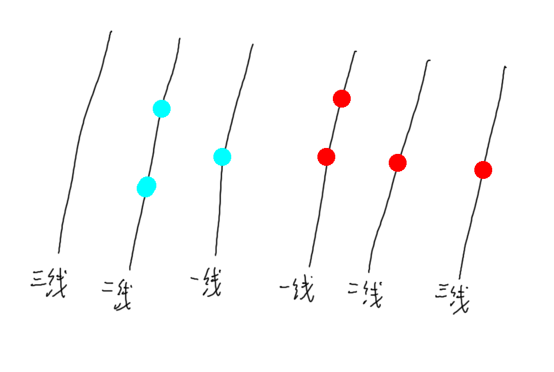
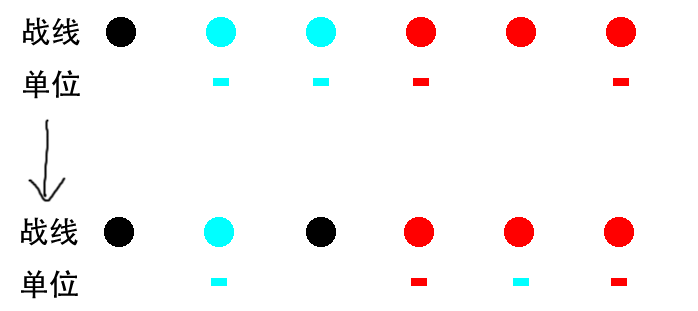

# 战场

整片战场分为六条战线，即双方的一线，二线，三线。



## 占领

当一条中立战线有一个我方单位时，该条战线将被我方占领。

两条被我方占领的线之间仅有中立战线时，其将自动被我方占领。

一条线必须处于中立状态时才可被占领，已经被占领的战线无法被对方占领。



## 入场

双方入场时，至少应该有一人处于一线，其余队友可任意选择在我方的战线。

## 移动

移动有多种分类，可以通过这些方式来变换自己的位置。

### 转移

从 被我方所占领的战线 向 被我方所占领的战线 移动。

消耗

```
ap -= Clamp((200-敏捷) / 12, 7, 16)
```

### 推进

从 被我方所占领的战线 向 中立战线 移动。

消耗

```
ap -= Clamp((200-敏捷) / 10, 8, 20)
```

### 突进

从 被我方所占领的战线 向 被敌方占领的战线 移动。

消耗

```
ap -= Clamp((200-敏捷) / 8, 13, 25)
```

### 回撤

从 被敌方占领的战线 向 被我方所占领的战线 移动。

消耗

```
ap -= Clamp((200-敏捷) / 10, 8, 20)
```

### 突破

从 被敌方占领的战线 向 中立战线 移动。

消耗

```
ap -= Clamp((200-敏捷) / 8, 13, 25)
```

### 深入

从 被敌方占领的战线 向 被敌方占领的战线 移动。

消耗

```
ap -= Clamp((200-敏捷) / 6, 15, 30)
```

## 脱战

也许一场战斗不一定非要胜利或失败，提前脱离战斗也不失为一种方法。

### 撤退

当处于我方三线时可撤退，若我方二、三线均未被敌人占领则必定撤退成功，否则需要进行一次敏捷判定。

无论撤退成功与否，都会消耗所有行动点（虽然撤退成功了行动点也无意义了就是了）。

当敌人未占领我方三线，但占领我方二线时。

```
想要撤退的角色的敏捷值 + 1d100 >= 我方二线上敌方敏捷最大值 时 则撤退成功
```

当敌人占领我方三线时

```
想要撤退的角色的敏捷值 + 想要撤退的角色的行动点 + 1d100 >= 我方三线上敌方敏捷最大值 + 我方三线上敌方行动点最大值 时 则撤退成功
```

### 突围

当处于敌方三线时可突围，若敌方二、三线均未被敌人占领则必定突围成功，否则需要进行一次敏捷判定。

无论突围成功与否，都会消耗所有行动点。

当敌人未占领敌方三线，但占领敌方二线时

```
想要突围的角色的敏捷值 + 1d100 >= 敌方二线上敌方敏捷最大值 时 则突围成功
```

当敌人占领敌方三线时

```
想要突围的角色的敏捷值 + 想要突围的角色的行动点 + 1d100 >= 敌方三线上敌方敏捷最大值 + 敌方三线上敌方行动点最大值 时 则突围成功
```

# 战斗限制

战斗无非就是造成伤害和抵挡伤害。在此基础上，借助其他行为可以最大化收益。

## 距离

几乎所有武器都有攻击距离的设定。甚至可以说，一个角色一开始自身的站位基本上是固定的。

攻击距离为 1 表示你可以对相邻线的目标发起攻击，0 则意味着你必须和对方站在同一条线上才能攻击。

### 最佳攻击距离

在这个距离上你的武器可以取得最大效率，尽量保证自身处于优势。

### 距离过近

只要你的攻击距离够大，你当然可以同时覆盖到更近的目标。然而如果目标与你的距离太近，那么你的攻击效果将大打折扣。

具体情况依武器为准。

### 距离过远

部分武器允许你在更远的距离外攻击，但这自然会导致另一方面的削弱。

具体情况依武器为准。

## 回合与行动点

战斗采用回合制，所有人确认结束回合后算作一轮。

### 回合顺序

开始时将会以战斗发起方为先手，双方可自行决定本次战斗的回合排序，但排序最靠前者必须处于我方一线。

双方队伍将轮流转交行动权，队内按照排序逐个转交行动权，即 

```
A1 -> B1 -> A2 -> B2 -> ……
```

### 行动点（ap）

战斗时的行为大多依赖于行动点，行动点每回合都会发放一些。

行动点初始值为20点，随后每回合获得30点。

### 回合阶段

每个回合都分为多个阶段，每个阶段所需要处理的事件也不同。

```
判定阶段：对自身所有效果进行判定或执行。
回合计数阶段：所有自己产生的回合事件时间减少 1。
行动点获取阶段：获取行动点。
行动阶段：可以进行攻击，移动，使用技能或道具等行为。
结束阶段：结束回合
```

## 视野

一般要先能看到目标才能攻击，换言之只要不被发现就更为安全。

### 隐蔽

尚未被发现的时候你往往可以松一口气，因为此时一般不会有人来攻击你。

### 发现

任何单位都会尝试搜寻附近的目标，效率取决于双方的侦查值和隐蔽值。

单位在移动或攻击时都可能被发现，此时敌方可选择花费一定的 ap 来进行一次发现判定。

每次行动仅可被执行一次发现判定。

消耗
```
ap -= 5 * 距离 - 3
```

发现判定

```
发起者的侦查值 + 1d100 >= 进行行动的单位的隐蔽值 + 距离 * 6
```

### 暴露

被发现的目标将会进入暴露状态，处于暴露状态的目标可以被选定为攻击目标。

暴露一回合后可以进行隐蔽判定，但在恢复隐蔽前每次移动或攻击都将刷新一回合计时。

如果在这两回合内没有任何人尝试攻击自己，那么自身将立即恢复隐蔽。

隐蔽判定
```
自身隐蔽值 + 距离 * 3 + 1d100 >= 最后一个尝试攻击自己的单位的侦查值
```

### 强制暴露

当双方有单位在相邻战线时，两条战线上所有单位都会被强制暴露。

被强制暴露的单位和普通暴露一致。

# 战斗机制

## 攻击

### 近战攻击判定

最为朴素的攻击方式，往往拥有着较低成本和较稳定的输出。

命中判定
```
当 Clamp(攻击者的力量点数 - 被攻击者的防御点数, -20, 20) + 1d100 >=
	90
		近战大暴击
	60
		近战小暴击
	30
		近战命中
	否则
		近战未命中
```

伤害判定

```
近战命中
	攻击者的武器伤害 * Clamp(((100 - 被攻击者的装甲) / 100 + 被攻击者的装甲 * 攻击者的武器穿甲 / 10000), 0.2, 1)
	如果是锐器
		流血判定
近战小爆击
	近战命中 * 1.2
近战大暴击
	近战命中 * 1.5
```

### 枪械攻击判定

典型的远程攻击方式，成本稍高但伤害也高。

命中判定
```
当 Clamp(攻击者的命中点数 - 被攻击者的敏捷点数, -30, 30) + 1d100 >=
	120
		枪械大暴击
	70
		枪械小暴击
	40
		枪械命中
	否则
		枪械未命中
```

伤害判定

```
枪械命中
	攻击者的武器伤害 * Clamp(((100 - 被攻击者的装甲) / 100 + 被攻击者的装甲 * 攻击者的武器穿甲 / 10000), 0.2, 1)
	流血判定
枪械小爆击
	枪械命中 * 1.5
枪械大暴击
	枪械命中 * 2.5
```

## 附加伤害

命中目标时当然也会造成一些额外影响。

### 流血

流血是最典型的附加伤害了，几乎有伤口的地方都有它。

流血判定
```
当 Clamp(20 + 1d100 - 被命中者的运气, 0, 100) >=
	80
		流血等级 +=2
		流血时长 +=3 回合
	60
		流血等级 +=1
		流血时长 +=2 回合
	否则
		无效果
```

效果
```
判定阶段
	角色 hp -= 流血等级 * 5
回合计数阶段
	流血时长 -= 1
	当 流血时长 == 0 时
		流血等级 = 0
		流血停止
```